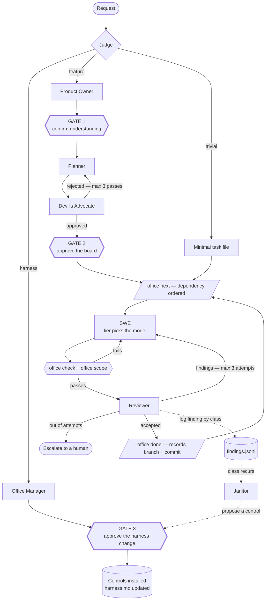
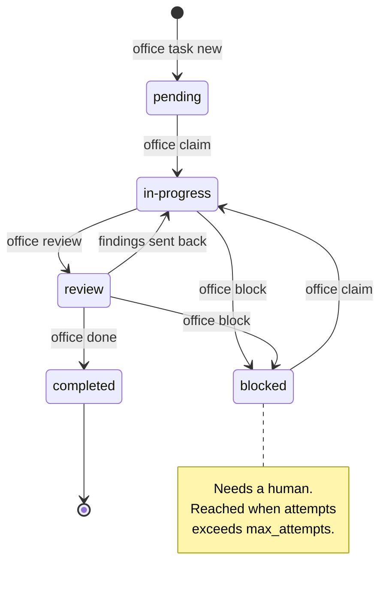

# the-office

A versioned set of Claude Code skills that install a working **harness** into any
repository — greenfield or legacy — and then build software through it.

> `Agent = Model + Harness`. The harness is everything that regulates the model:
> **guides** that steer before it acts, **sensors** that catch it after. Each is
> either **computational** (deterministic, cheap, runs on every change) or
> **inferential** (a model's judgement — richer, slower, probabilistic).

The roles below are inferential controls. Their purpose is to produce
*computational* ones.

## How it works

A request enters through the Judge and leaves as completed tasks whose
definitions of done a machine has verified. Hexagons are the points where a
human must approve; the dotted path is the steering loop, which turns a
recurring defect into a control so it stops recurring.



Two things in that picture do the real work.

**The `office check + office scope` node is not a review step.** It is two shell
commands. A task whose checks exit non-zero cannot reach the Reviewer, which
means expensive inferential attention is never spent on something a CPU has
already settled.

**The dotted path is what makes the harness compound.** Without it the Reviewer
catches a defect, the SWE fixes it, and the next feature reproduces it forever.
The Janitor converts a recurring finding class into a type, a lint rule, or a
fitness function — and that proposal goes through Gate 3 like any other harness
change.

### Task lifecycle

Statuses move through the CLI, never by editing frontmatter. Only the Reviewer
runs `office done`; a SWE that marks its own work complete has removed the
review from the pipeline.



## Install

```bash
git clone <this repo> ~/src/the-office
~/src/the-office/install.sh /path/to/your/repo
```

Then, in that repo:

```
/office-onboard          audit the harness and propose the controls it lacks
/office <request>        run a request through the pipeline
/office-board            show the board
/office-next             execute the next ready task
```

`--link` symlinks instead of copying, for iterating on the-office itself.
`--uninstall` removes the payload and leaves your board state alone.

## The roster

| Role | Tier | Job |
|---|---|---|
| **Judge** | fast | Routes: trivial · feature · harness |
| **Office Manager** | deep | Audits and installs the harness |
| **Product Owner** | standard | Clarifies the request → **Gate 1** |
| **Planner** | deep | Decomposes into tasks with executable checks |
| **Devil's Advocate** | deep | Adversarial plan review → **Gate 2** |
| **SWE** | per task | Implements, and leaves a sensor behind |
| **Reviewer** | deep | Three-lens review, logs findings by class |
| **Janitor** | standard | Turns recurring findings into controls → **Gate 3** |

## The three gates

**Gate 1** — after clarification. **Gate 2** — after the plan converges, before
any code. **Gate 3** — before any harness change.

Gate 3 is the one worth defending. A new hook changes every contributor's
workflow, not just the agent's.

## The deterministic core

Everything a CPU can settle lives in one zero-dependency Node CLI, not in a
prompt:

```bash
office next                 # next ready task, dependency-ordered
office check <id>           # run the task's executable definition of done
office scope <id>           # assert the diff stayed inside the task's globs
office validate             # schema, duplicate ids, orphan deps, cycles
office audit                # stacks, existing controls, harnessability score
office pack show <stack>    # controls in strangler order for a legacy repo
office findings recur       # defect classes that should become controls
```

`office help` lists the rest.

## What makes a task done

`dod:` is prose for the human. **`checks:` is the contract** — shell commands
that must exit 0. `office validate` rejects an empty `checks:` list.

A check must fail before the work and pass after. One that is already green on
an untouched checkout verifies nothing.

## Legacy repos

`office pack show <stack>` prints controls in adoption order. Follow it. The
failure mode is specific: enable strict checking repo-wide, get four thousand
errors, nobody triages them, the first person who hits the wall disables the
harness, and the repo is now worse than when you found it.

So: cheap already-clean controls first, thresholds pinned to current measured
values rather than targets, new-code-only gating where the tool supports it, and
hooks last.

## Documents

- [`PLAN.md`](./PLAN.md) — the implementation plan and the reasoning behind each
  departure from the original spec.
- [`skills-requests.md`](./skills-requests.md) — the original spec, preserved.
- [`.the-office/harness.md`](./.the-office/harness.md) — this repo's own harness,
  including its open gaps.

## Development

```bash
bash tests/run.sh                     # the sensor suite; must be green
git config core.hooksPath .githooks   # install the pre-commit sensor
```

The CLI stays zero-dependency. That is what lets a target repo run it with
nothing but the Node that Claude Code already requires.

## Releasing

`VERSION` is the single source of truth. It is propagated to `package.json` and
the `VERSION` constant in `payload/bin/office.mjs`; `tests/run.sh` and the
pre-commit hook both fail if they drift apart, so `scripts/bump.sh` is the only
supported way to change it.

```bash
# 1. write the notes under ## [Unreleased] in CHANGELOG.md
# 2. cut the release
scripts/bump.sh patch          # or minor | major | X.Y.Z
scripts/bump.sh patch --dry-run   # see what it would do first

# 3. publish
git push && git push origin v$(cat VERSION)
```

`bump.sh` refuses a dirty tree, refuses an empty Unreleased section, runs the
sensor suite before tagging, and dates the release section as it moves it.

The `release` workflow fires on the `v*` tag: it verifies the tag matches
`VERSION`, runs the suite, smoke-tests an install from the tagged tree, extracts
that version's changelog section as the release notes, and publishes a tarball
of the installable payload.

## CI

| Job | What it covers |
|---|---|
| `sensors` | the suite on Node 18, 20, 22 |
| `shellcheck` | `install.sh`, `tests/run.sh`, `bump.sh`, the pre-commit hook |
| `install` | clean install, upgrade preserving board state, uninstall keeping `.the-office/` |
| `packs` | each pack's config run against the real tool — ruff, eslint, gofmt/vet, rustfmt, clippy |

The `packs` job matters most: those configs ship into other people's
repositories, and before it existed nothing had ever executed them.
